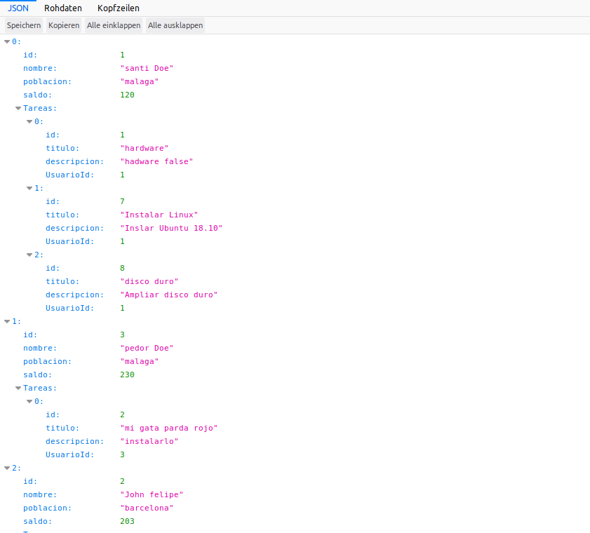
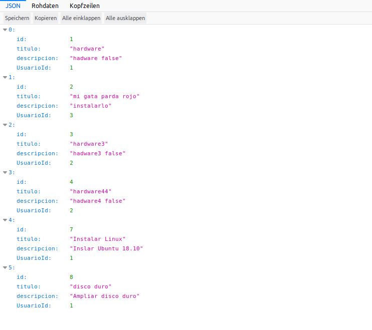

# node-sequelize-api-asoc
Api con node -sequelize -mysql y una simple asociacion de 1:n - hasMany / belongTo
simple asociacion de 1:n  - hasMany / belongTo

Globally

Instalamos sequelize-cli globalmente con:
```ruby
$ npm install -g sequelize-cli
```
**Hay realizar ejecutar los siguientes procesos para inicializar las tablas(sin foreign key):

```ruby
$ sequelize db:drop
$ sequelize db:create
$ sequelize db:migrate
$ sequelize db:seed:all
$ npm start
```
**Si queremos que se cree tambien la clave foranea (foreign key) tenmos que omitir el paso "$ sequelize db:create" 
y crear nosotros manualmente la base de datos. Los pasos serian:
```ruby
$ sequelize db:drop 
mysql>create database seq_db;
$ npm start (nos salimos)
$ sequelize db:seed:all
$ npm start
```


Este seria un ejemplo de un listado completo de usuarios con todas sus tareas:
http://miip:3000/usuarios/lista_completa



Este es un listado simple de tareas :
http://miip:3000/tareas/listado


